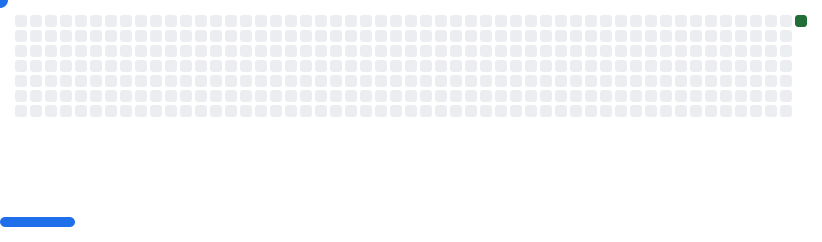

# mi-portafolio
Hola, soy David Sánchez, desarrollador web con enfoque en backend y conocimientos de frontend, trabajando como Junior Full Stack Developer.

Este repositorio contiene mi portafolio web, con proyectos que demuestran mis habilidades en desarrollo web y programación backend.

Tecnologías

Backend: PHP

Base de datos: MySQL

Frontend: HTML, CSS, JavaScript

Control de versiones: Git / GitHub
<picture>
  <source media="(prefers-color-scheme: dark)" srcset="images/dark.svg" />
  <source media="(prefers-color-scheme: light)" srcset="images/light.svg" />
  
</picture>
