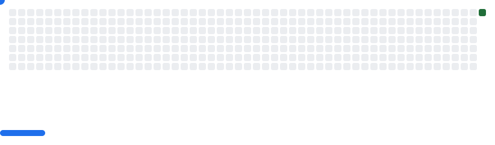

# 🌐 David Sánchez - Portafolio

Hola, soy **David Sánchez**, desarrollador web con enfoque en backend y conocimientos de frontend, trabajando como Junior Full Stack Developer.

## 🚀 Mi Portafolio

Visita mi portafolio para conocer más sobre mi trabajo y proyectos:

🔗 **[https://jdgutierrez.online/](https://jdgutierrez.online/)**

<picture>
  <source 
    srcset="images/dark.svg" 
    media="(prefers-color-scheme: dark)" 
  />
  
</picture>

## 💻 Tecnologías

- **Backend:** PHP
- **Base de datos:** MySQL
- **Frontend:** HTML, CSS, JavaScript
- **Control de versiones:** Git / GitHub

⭐ *Desde mi corazón de código - ¡Gracias por visitar!*
